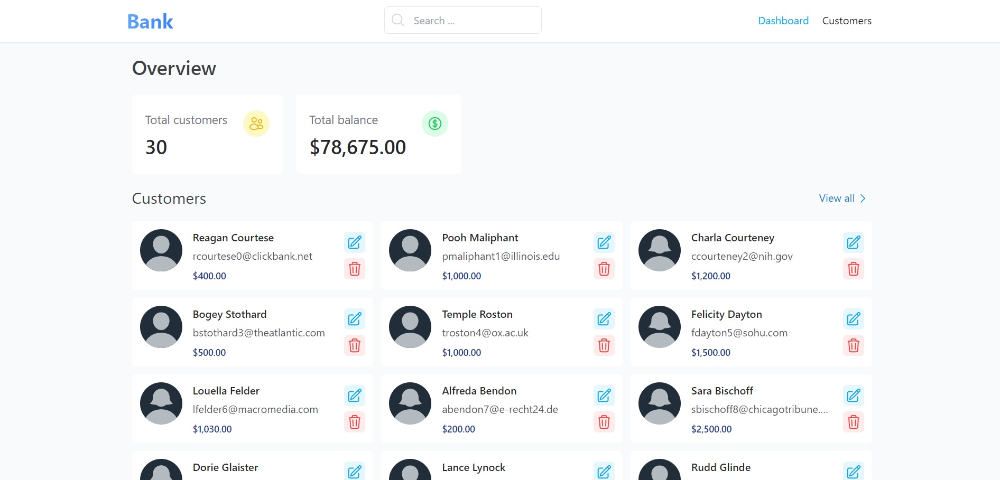

# BankApp

A simple bank management application built with Angular 



## Getting started

### Setup the server

Install `json-server` globally using `npm` or `yarn`

```bash
yarn add -g json-server # or npm i -g json-server
```

Type the following command to run the server: 

```
json-server --watch db.json
```

### Run the application
Execute the following command to run the dev server
```bash
yarn start # or npm start
```
Navigate to `http://localhost:4200/` to see the result.